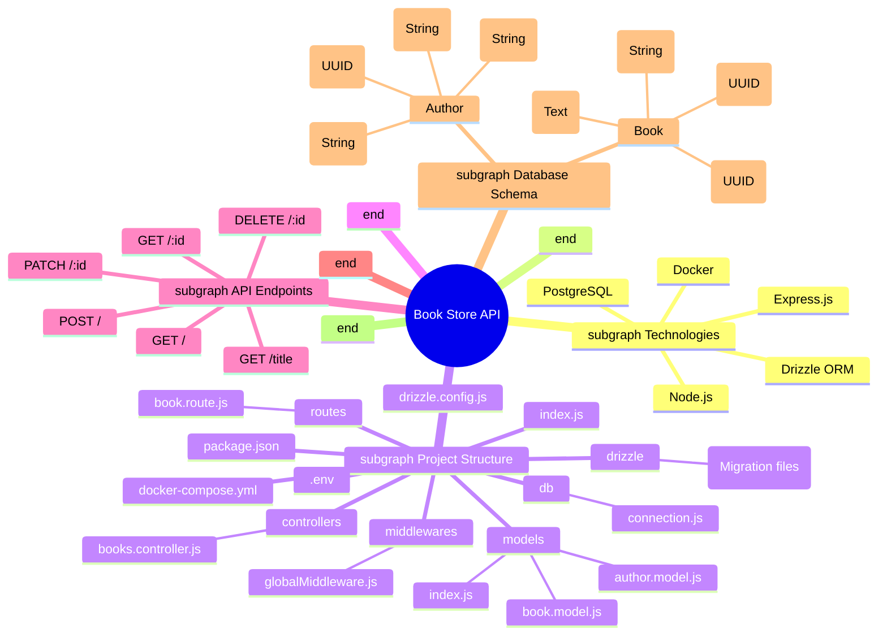

# 🚀 Project Analysis: Book Store API 📚

Welcome to the analysis of the Book Store API project! This document will guide you through the project's architecture, technologies, and code, making it easy for anyone to understand.

## 🗺️ Project Mind Map



## 🛠️ Technologies Used

This project uses a modern stack for building a robust and scalable backend API.

*   **Node.js**: A JavaScript runtime environment that lets you run JavaScript on the server-side.
*   **Express.js**: A minimal and flexible Node.js web application framework that provides a robust set of features for web and mobile applications.
*   **PostgreSQL**: A powerful, open-source object-relational database system.
*   **Drizzle ORM**: A TypeScript ORM for SQL databases that provides a type-safe way to interact with your database.
*   **Docker**: A platform for developing, shipping, and running applications in containers.

## 📂 Project Structure Explained

The project follows the Model-View-Controller (MVC) architectural pattern, which separates the application into three main components:

*   **Models**: Represents the data and business logic of the application. In this project, the models are defined in the `models` directory.
*   **Views**: The user interface of the application. In this project, we don't have views as it is a backend API.
*   **Controllers**: Handles the user's requests and interacts with the models and views. The controllers are defined in the `controllers` directory.

Here's a breakdown of the project's directory structure:

*   **`controllers`**: Contains the controller files that handle the business logic of the application.
    *   `books.controller.js`: Handles the CRUD (Create, Read, Update, Delete) operations for books.
*   **`db`**: Contains the database connection file.
    *   `connection.js`: Establishes the connection to the PostgreSQL database using Drizzle ORM.
*   **`drizzle`**: This directory is automatically generated by Drizzle and contains the migration files.
*   **`middlewares`**: Contains the middleware files.
    *   `globalMiddleware.js`: A simple global middleware that logs a message for every request.
*   **`models`**: Contains the database schema definitions.
    *   `author.model.js`: Defines the schema for the `Author` table.
    *   `book.model.js`: Defines the schema for the `bookLibrary` table and includes an index on the `title` column.
    *   `index.js`: Exports all the models.
*   **`routes`**: Contains the route files that define the API endpoints.
    *   `book.route.js`: Defines the routes for the book-related API endpoints.
*   **`.env`**: A file to store environment variables like database credentials.
*   **`docker-compose.yml`**: A Docker Compose file to run the PostgreSQL database in a Docker container.
*   **`drizzle.config.js`**: The configuration file for Drizzle ORM.
*   **`index.js`**: The main entry point of the application.
*   **`package.json`**: The project's manifest file that contains the project's metadata and dependencies.

## 📈 Table Indexing Explained

In the `models/book.model.js` file, you'll find the following code:

```javascript
index('title_index').using('gin', sql`to_tsvector('english', ${table.title})`),
```

This line of code creates an index on the `title` column of the `bookLibrary` table. Let's break it down:

*   **`index('title_index')`**: This creates an index named `title_index`.
*   **`.using('gin', ...)`**: This specifies that we want to use the GIN (Generalized Inverted Index) index type. GIN indexes are well-suited for indexing composite values where elements to be searched are part of the composite value, such as text documents.
*   **`sql`to_tsvector('english', ${table.title})`**: This is the expression that we want to index.
    *   **`to_tsvector('english', ...)`**: This is a PostgreSQL function that converts a text string into a `tsvector`, which is a sorted list of distinct words that have been normalized to merge different variants of the same word.
    *   **`${table.title}`**: This is the `title` column of the `bookLibrary` table.

### Why is this important?

By creating this index, we can perform full-text searches on the `title` column much more efficiently. When a user searches for a book by its title, the database can use this index to quickly find the matching books, instead of having to scan the entire table.

This is demonstrated in the `controllers/books.controller.js` file:

```javascript
exports.getBookByTitle = async (req, res)=>{
    const bookTitle = await req.query.bookTitle;
    console.log("😂 bookTitle", bookTitle)

    const result = await db.select().from(bookTable).where(sql`to_tsvector('english', ${bookTable.title}) @@ plainto_tsquery('english', ${bookTitle})`);
    console.log("😈", result);

    res.json({apiResponse: result})
}
```

In this code:

*   **`plainto_tsquery('english', ${bookTitle})`**: This function converts the user's search query into a `tsquery`, which is a data type that represents a text search query.
*   **`@@`**: This is the match operator, which returns `true` if the `tsvector` matches the `tsquery`.

By using this approach, we can build a powerful and efficient search functionality for our Book Store API.

## 📝 Summary

This project is a great example of how to build a modern backend API using Node.js, Express.js, PostgreSQL, and Drizzle ORM. It demonstrates the use of the MVC architectural pattern, database migrations, and advanced database features like full-text search. By studying this project, you can learn how to build your own robust and scalable backend applications.
